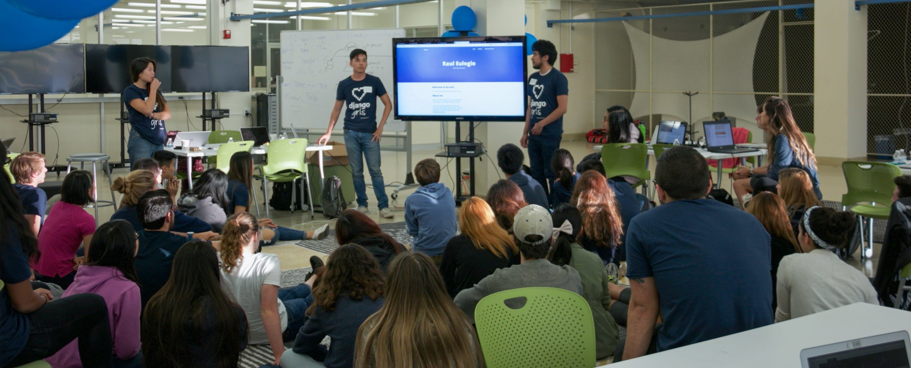
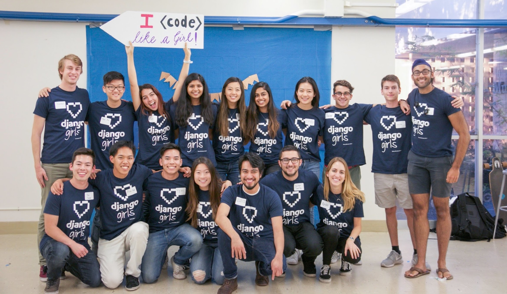

# DjangoGirls Santa Barbara: a Web Development Workshop
### Jonathan Hsu
###### Jan 6, 2018

*Coaches and attendees showing all smiles after a long day of coding together.*

Data Science at UCSB hosted Santa Barbara’s first ever DjangoGirls event on Saturday, November 18th, 2017. [DjangoGirls](https://djangogirls.org) is an organization which provides resources and sanctions events to help introduce more women into the male-dominated tech industry. The goal of this workshop was for participants who were unfamiliar with programming to get their feet wet and to do so by learning how to build a web application from scratch using Django, a Python web development framework. To this end, we assembled a team of experienced coaches to guide attendees who had little to no prior coding experience such that they could leave the workshop having created and deployed personal blogs of their own. We've included links to a few of the blogs completed during the workshop at the end of the article.

Every so often, Data Science at UCSB hosts technical workshops offering participants opportunities to explore new interests and learn skills relevant in the industry. Those who attended the previous workshop learned the fundamentals of SQL, a programming language used in database management. Compared to previous workshops, the DjangoGirls workshop was meant to be much more comprehensive. It was to be a full-day experience through which participants would learn how to use a popular programming language called Python to create their own personal blogs. Due to limited resources coupled with a lofty goal, the workshop had to be selective; out of a pool of over 180 applicants, only 40 participants were accepted. For those who could not attend but are interested in learning what we covered, [here](https://tutorial.djangogirls.org/) is the tutorial provided by DjangoGirls that guided the workshop.

First things first, to avoid complications on the day of the workshop, an "installation party" was held the prior evening. Here, coaches helped participants get their machines set up with the tools they'd be using the next day. The installation party was split into two sessions to accommodate attendees using Windows as well as those using MacOS/Linux. Participants first installed Python followed by Atom, a text editor for writing their Python code. They were then introduced to the concept of virtual environments and then shown how to install Django using a package manager. The installation party finished with attendees setting up accounts with GitHub and PythonAnywhere, which they would be using to deploy, or publish, their applications to the internet. At this point, participants were fully equipped for the workshop which began the next morning.

The day kicked off with breakfast - participants enjoyed bagels, bananas, and coffee to fuel them for the long day ahead. The workshop with three brief presentations. The first presentation went over the workings of the internet and was meant to provide attendees with context on the ecosystem that they would be building in. Without getting too technical, coaches gave high-level explanations of the structure of the internet, how information travels through it, and how it works for users. In the second presentation, coaches introduced attendees to Python and its capabilities which included, but was not limited to, creating a blog. The coaches giving this presentation went as far as creating a rudimentary text-interface adventure game! They demoed the game with some participation from the audience before revealing the code to showcase the simplicity of developing in Python. The last presentation introduced a web development framework, Django, along with the [Model-View-Controller Design Pattern](https://djangobook.com/model-view-controller-design-pattern/) that participants would be employing through Django.

*Attendees participating in the interactive text game created by coaches.*

After having established a better understanding of what they'd be working with, participants were ready to begin coding. Attendees were split into teams of three to four, each of which was accompanied by one or two coaches. The nimble structure of the groups provided coaches with the opportunity to work closely with their teams, allowing for quicker iteration as well as deeper learning.

*Coaches and attendees introducing themselves shortly after teams were formed.*

Once groups had settled in, the work began. Each group worked at its own pace, with some progressing surprisingly quickly. Around noon, teams paused for lunch, and at this point, most teams had just completed the deployment stage, which meant their applications were accessible through the internet. After finishing their sandwiches and salads, participants eagerly continued working on their applications, filling them with the functionality and content that would constitute their creations as blogs. By the end of the workshop, after a total of roughly six hours of development, most teams had successfully completed the tutorial. At this point, the majority of participants had fully functional applications, and were exploring the design elements of their blogs. After some last minute troubleshooting here and there, everyone gathered to close the event.

*White boards came in handy for visualizing certain ideas.*

To wrap things up, coaches guided participants in reviewing what they had learned and accomplished during the workshop. The room bristled with laughter as participants recalled the common roadblocks and successes they encountered throughout the day. Additionally, attendees were offered the chance to bring home a bluetooth speaker provided by Microsoft. To choose the winner, one of our coaches, Matthew, quickly spun up a python script for raffling as attendees followed along on the screen. Finally, Raul, one of the event coordinators, briefly presented his slightly more complex personal website to inspire attendees and give them an idea of how they could take their new web apps further now that the workshop was ending.

*Coach Raul sharing his personal website.*

Ultimately, the workshop succeeded in its goal of demystifying the understandably intimidating concept of programming and introducing it to those who were unfamiliar with it; some attendees noted that they never would have guessed how easy it was to get started, and they all agreed that they were leaving the workshop much more comfortable working with their computers now that they'd built something with code. While the day was aimed at teaching attendees, it appears that our coaches also benefitted from it; one coach, Kaizen, reported that "teaching Django to \[his\] team provided \[him\] with a deeper, more solid understanding of the framework." That's great, Kaizen! Our workshops, as are any of our other events, are hosted with the purpose of promoting learning, and we are happy to hear that this one was no exception. [Follow us](https://www.facebook.com/DataScienceUCSB/) to be notified when the next one comes around!

*Thanks to the amazing coaches who made this workshop possible!*

Here are some of the blogs created by our amazing participants during the workshop:  
- [Carmen Galaz-García, 3rd year PhD student studying mathematics](http://carmengg.pythonanywhere.com/)  
- [Cynthia Zhang, 1st year undergraduate student studying computer science](http://czhang19.pythonanywhere.com/)  

Click [here](https://www.facebook.com/pg/DataScienceUCSB/photos/?tab=album&album_id=1247553482055196) to see more photos from the event.
